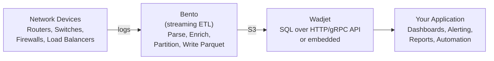

# Wadjet Documentation

Wadjet is an analytical query engine written in Go, inspired by systems like DuckDB. It provides columnar storage via Parquet, vectorized query execution, SQL support, and optional distributed processing over NATS and S3-compatible object storage.

## Documentation Index

| Guide | Description |
|-------|-------------|
| [Getting Started](getting-started.md) | Installation, first table, first query |
| [Architecture](architecture.md) | System internals, execution model, data flow |
| [Configuration](configuration.md) | YAML config, environment variables, CLI flags |
| [Data Types](data-types.md) | Supported column types including network primitives |
| [Ingestion](ingestion.md) | Writing data: micro-batch accumulator, partitioning, Bento pipelines |
| [SQL Reference](sql-reference.md) | Supported SQL syntax, functions, operators |
| [HTTP API](api-reference.md) | REST endpoints for queries, tables, health |
| [gRPC API](grpc-api.md) | Protobuf service for multi-language client generation |
| [Embedding](embedding.md) | Using Wadjet as a Go library via `wadjet` |
| [Distributed Deployment](distributed.md) | Multi-node setup, federation, cluster routing |
| [Security](security.md) | API keys, JWT, mTLS, RBAC, cell-level policies |
| [Performance Tuning](tuning.md) | Environment profiles, memory/spill tuning, methodology |
| [Network Analytics Workflow](network-analytics.md) | End-to-end: device logs -> Bento -> Wadjet -> app |
| [Operations](operations.md) | Monitoring, Prometheus metrics, troubleshooting |

## Typical Workflow

## Quick Links

- **Repository**: [github.com/citc-tech/wadjet](https://github.com/citc-tech/wadjet)
- **Go Package**: `github.com/citc-tech/wadjet/wadjet`
- **License**: See repository root
