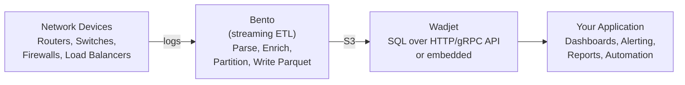

# Wadjet Documentation

Wadjet is a distributed SQL query engine for analytical (OLAP) workloads,
written in Go: columnar storage in Apache Parquet (and Apache Iceberg metadata)
on S3-compatible object storage, vectorized execution, full analytical SQL, a
PostgreSQL wire-protocol front end, and a coordinator + worker distribution
model. Its differentiating niche is network telemetry — IPv4, IPv6, CIDR, MAC,
Port and Protocol are first-class column types with 100+ network functions.

## Documentation Index

| Guide | Description |
|-------|-------------|
| [Getting Started](getting-started.md) | Installation, first table, first query |
| [Architecture](architecture.md) | System internals, execution model, data flow |
| [ADRs](adr/README.md) | Architecture decision records — what's settled, what it beat, and the evidence |
| [Benchmarks](benchmarks/README.md) | Every measurement memo: topology, scale factor, headline numbers, reproduction |
| [Internals: native-DAG execution](internals/native-dag-execution.md) | File-anchored map of the distributed execution path |
| [Configuration](configuration.md) | YAML config, environment variables, CLI flags |
| [Data Types](data-types.md) | Supported column types including network primitives |
| [Ingestion](ingestion.md) | Writing data: micro-batch accumulator, partitioning, Bento pipelines |
| [SQL Reference](sql-reference.md) | Supported SQL syntax, functions, operators |
| [HTTP API](api-reference.md) | REST endpoints for queries, tables, health |
| [gRPC API](grpc-api.md) | Protobuf service for multi-language client generation |
| [Embedding](embedding.md) | Using Wadjet as a Go library via `wadjet` |
| [Distributed Deployment](distributed.md) | Multi-node setup, federation, cluster routing |
| [Security](security.md) | API keys, JWT, mTLS, RBAC, cell-level policies |
| [Performance Tuning](tuning.md) | Environment profiles, memory/spill tuning, methodology |
| [Network Analytics Workflow](network-analytics.md) | End-to-end: device logs -> Bento -> Wadjet -> app |
| [Operations](operations.md) | Monitoring, Prometheus metrics, troubleshooting |
| [Runbook](runbook.md) | Run scenarios, the full flag surface, Kubernetes lifecycle |
| [Disaster Recovery](disaster-recovery.md) | Catalog snapshots, recovery scenarios, RTO/RPO |
| [Performance Bottlenecks](performance-bottlenecks.md) | Known engine bottlenecks and their status |
| [Competitive Gaps](competitive-gaps.md) | What Wadjet does not do yet, and against whom |

## Typical Workflow

## Quick Links

- **Repository**: [github.com/derekmwright/wadjet](https://github.com/derekmwright/wadjet)
- **Go Package**: `github.com/derekmwright/wadjet/wadjet`
- **License**: See repository root
