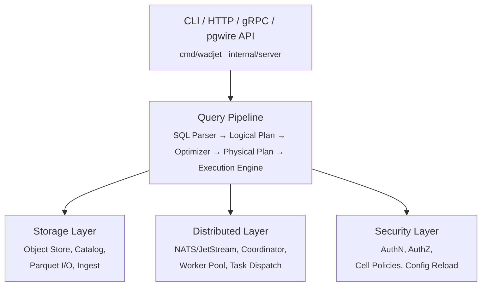
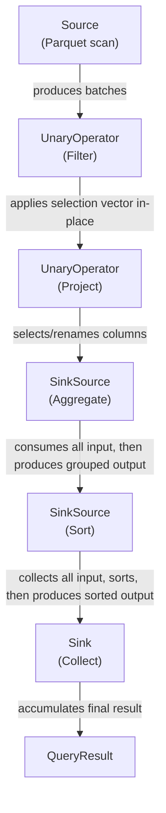
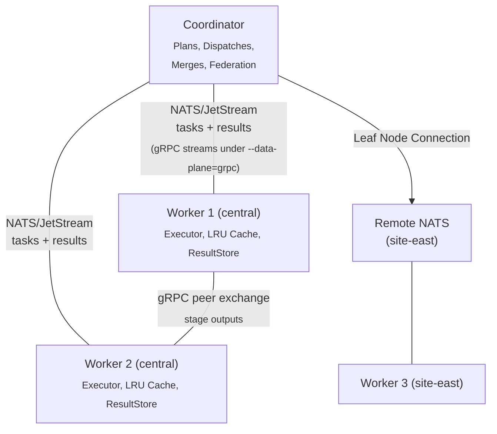

# Architecture

Wadjet is a **distributed SQL query engine for analytical (OLAP) workloads**: a
columnar engine with vectorized execution over Apache Parquet and Apache
Iceberg tables on S3-compatible object storage, written in Go, with a query
coordinator and worker processes and a PostgreSQL wire-protocol front end. This
document covers the system's internals.

## The engine in one table

Every row is vocabulary this codebase actually implements, with where to read
it. Nothing here is aspirational; where a mechanism is off by default that is
stated.

| Mechanism | What it means here | Where |
|---|---|---|
| SQL parser | hand-written recursive descent, no parser generator | `internal/planner/sql/`, [ADR-0003](adr/0003-recursive-descent-parser.md) |
| Logical plan + optimizer | typed node tree, rule-based rewrites, and cost-based join reordering (DP up to 16 relations, greedy beyond) over column statistics populated at ingest or by `ANALYZE TABLE`, with min/max and heuristic fallbacks when neither ran | `internal/planner/logical/optimizer.go:3848`, `stats.go:143-144` (the two populators) and `:152-162` (the min/max fallback) |
| Physical plan | executable pipelines, and for distributed queries a DAG of stages | `internal/planner/physical/` |
| Push-based vectorized execution | Source → UnaryOperator chain → Sink over 2048-row batches, selection vectors instead of copies, type dispatch resolved once per batch into typed kernels | `internal/engine/exec/`, [ADR-0002](adr/0002-push-based-vectorized-execution.md) |
| Pipeline breakers with spill | hash join (grace partition-on-arrival), hash aggregate (partial-state k-way merge), sort and window (external sorted-run merge) | `internal/engine/exec/`, [ADR-0027](adr/0027-a-spill-gate-proves-it-spilled.md) |
| Memory budget, never-OOM | shared per-process pool, per-task charges, ownership ledger, OS-facing relief valves | `internal/engine/memory/`, [ADR-0006](adr/0006-never-oom-memory-model.md) |
| Morsel-driven parallelism | intra-fragment parallel pipeline consumers, width adapts to input size and idle CPU tokens (`--morsel-workers=1` is the serial kill switch) | `internal/engine/exec/`, [design note](design/morsel-execution.md) |
| Stage-DAG execution | each stage's output materializes to the object store and the next stage reads it back — exchange spooling, the model Trino calls fault-tolerant execution, **not** a classic streaming exchange between concurrently running stages | [internals map](internals/native-dag-execution.md), [ADR-0004](adr/0004-stage-dag-with-streaming-exchange.md) |
| Streaming-exchange overlay | on top of that, a consumer reads a producer's output through a tier ladder — same-worker mmap, then NATS KV for small payloads (≤ 4 MB), then a peer fetch over gRPC, with S3 as the last-resort tier — while the upload proceeds asynchronously; any failure falls through to the durable copy (default on) | `internal/worker/stream_source.go:742, 759, 790, 814`; [design note](design/streaming-exchange.md) lines 78-81 and 253-258; [ADR-0004](adr/0004-stage-dag-with-streaming-exchange.md) §Decision 2 (amended — its prose ordered peer gRPC before KV) |
| Hash-partitioned shuffle | `exchange-repartition` stages write one `.wshf` columnar shuffle file per output partition. The format has one writer package (`internal/worker/shuffle_format.go`) and one reader package (`internal/wshf/`) by decision | [ADR-0010](adr/0010-shuffle-wire-formats.md) §Decision, lines 43-54 |
| Broadcast + probe-split joins | a build side under the broadcast threshold replicates to every worker and the probe files split across workers | `internal/coordinator/`, [design note](design/scan-affinity.md) |
| Skew-aware splits | a partition group whose probe bytes exceed the floor *and* ≥2× the mean splits into k sub-tasks (`--skew-split=false` is the kill switch) | [design note](design/skew-aware-shuffle.md) |
| Small-query local fast path | a query whose post-pruning scan bytes stay under `--local-fastpath-bytes` (64 MiB default) runs in-process on the coordinator, skipping the DAG | `internal/coordinator/local_fastpath.go`, [internals map](internals/native-dag-execution.md#small-query-local-fast-path-routing-ahead-of-the-dag) |
| 3-level predicate pushdown | partition pruning → row-group statistics pruning → row-level filtering, plus a dictionary-probe row-group prune (level 2.5) and LIKE pushdown into the level-3 filter | `internal/engine/scan/`, `dict_prune.go:11`, `like_filter.go:5` |
| Parquet reader/writer | own implementation: column projection, row-group pruning, nested types; a file's own statistics are treated as input, not fact | `internal/storage/parquet/`, [ADR-0018](adr/0018-parquet-file-numbers-are-input.md) |
| Iceberg metadata | read-only v1/v2 metadata, manifest lists and manifests, bridged into the native catalog | `internal/iceberg/` |
| NATS control plane | heartbeats, cancel/complete broadcasts, the KV catalog, and JetStream task queues in the default NATS dispatch mode | `internal/distributed/`, [ADR-0005](adr/0005-split-control-and-data-plane.md) |
| gRPC data plane | worker↔worker exchange fetches ride gRPC whatever `--data-plane` says (the peer listener exists whenever `--streaming-exchange` is on, its default — `cmd/wadjet/main.go:2710-2715`); task dispatch, results and gather payloads move there too under `--data-plane=grpc` | `internal/dataplane/`, [ADR-0005](adr/0005-split-control-and-data-plane.md) |
| Object-store circuit breaker | per operation class (read / write / delete), so a failing upload burst never fast-fails reads | [ADR-0028](adr/0028-operational-invariants-breaker-scope-and-query-reclamation.md) |
| PostgreSQL wire protocol | `psql`, JDBC/ODBC and BI clients connect directly; PostgreSQL decides semantics, DuckDB is the performance goal and an oracle | `internal/server/pgwire/`, [ADR-0012](adr/0012-sql-semantics-authority.md) |
| Kill switches | optimizations that could change the row set register a toggle (`WADJET_<NAME>=0`) and are swept by the invariance oracle | `internal/optswitch/` |
| Configuration precedence | explicit flag > environment > file > default, resolved once from one registry | `internal/config/`, [ADR-0029](adr/0029-configuration-precedence.md) |

## High-Level Architecture



## Package Layout

```
github.com/derekmwright/wadjet/
├── cmd/wadjet/             # CLI entry point (cobra commands)
├── wadjet/             # Public embeddable Go API
├── proto/wadjet/v1/        # Protobuf service definition
├── gen/wadjet/v1/          # Generated gRPC + protobuf Go code
├── internal/
│   ├── storage/
│   │   ├── objstore/       # S3-compatible object store abstraction
│   │   ├── catalog/        # Schema + partition metadata (NATS KV)
│   │   ├── parquet/        # Parquet reader/writer wrappers
│   │   ├── ingest/         # Micro-batch accumulator + partitioner
│   │   ├── compaction/     # Partition compaction (replaces its inputs)
│   │   ├── partition/      # Partition key derivation + Hive-style paths
│   │   ├── csv/            # read_csv reader
│   │   ├── json/           # read_json reader
│   │   └── dbscan/         # postgres_scan / mysql_scan
│   ├── iceberg/            # Apache Iceberg table metadata reader + catalog integration
│   ├── engine/
│   │   ├── batch/          # Record batches, vectors, selection vectors, BatchPool
│   │   ├── exec/           # Push-based pipeline executor
│   │   ├── expr/           # Expression compiler (SQL AST → functions)
│   │   ├── memory/         # MemoryTracker, SpillManager, spill-to-disk
│   │   ├── diskio/         # Spill-file I/O
│   │   └── scan/           # Scanner with 3-level pushdown
│   ├── planner/
│   │   ├── sql/            # Recursive descent SQL parser → SelectInfo
│   │   ├── logical/        # Logical plan tree + optimizer
│   │   └── physical/       # Physical plan + distributed stages
│   ├── coordinator/        # Distributed query coordinator + federated routing
│   ├── worker/             # Distributed task executor + result store
│   ├── distributed/        # NATS messaging layer + cluster-scoped subjects
│   ├── auth/               # Authentication + authorization
│   ├── config/             # YAML config with hot-reload
│   ├── server/             # HTTP API (net/http) + gRPC API + pgwire + MCP
│   ├── metrics/            # Prometheus metrics
│   ├── optswitch/          # Kill-switch registry (38 toggles, WADJET_<NAME>=0)
│   ├── alerts/             # CREATE ALERT runtime: scheduler, webhook + table sinks
│   ├── telemetry/          # OpenTelemetry OTLP trace export
│   ├── embedding/          # embed() providers (OpenAI, Voyage AI, Ollama)
│   ├── geoip/              # MaxMind lookup for the GeoIP functions
│   ├── dataplane/          # gRPC task dispatch (control/data plane split)
│   ├── wshf/               # WSHF columnar shuffle wire format
│   ├── sqlerr/             # SQLSTATE-carrying error wrapper
│   ├── oracle/             # Differential-oracle shape generator
│   └── format/             # table / json / csv output rendering
└── test/                   # Integration tests
```

## Data Model

### Columnar Storage

All data in Wadjet is stored in **Apache Parquet** files on S3-compatible object storage. Parquet provides:

- Columnar layout for analytical scan efficiency
- Built-in compression (Snappy default, Zstd, Gzip, LZ4 available)
- Schema-embedded metadata
- Row group organization for parallel reads

### Catalog

The catalog is a JSON-serialized metadata layer stored in **NATS KV** (bucket: `wadjet_catalog`). Keys are cluster-scoped:

```
<cluster-id>.meta              → CatalogMeta (version, table list, timestamps)
<cluster-id>.table.<name>      → TableMeta (schema, partition keys, version)
<cluster-id>.manifest.<name>   → PartitionManifest (partitions and file entries)
```

The `PartitionManifest` contains an array of `PartitionEntry` objects, each with a `path`, `values` (partition key → value map), and `files` (list of Parquet `FileEntry` objects with path, size, row count, and creation time).

**Concurrency control**: NATS KV provides revision-based optimistic concurrency — each key tracks a monotonic revision, and concurrent writers are detected automatically. An in-memory `MemKV` implementation is used for standalone/embedded mode.

**Distributed locking**: An optional `LockManager` uses NATS KV for read-write locks with a 30-second TTL, auto-refreshed every 10 seconds. Write locks are exclusive; read locks are shared.

### Record Batches

The in-memory unit of data is the **record batch**: a fixed set of columns (`Vector`s), each holding up to 2048 rows.

```
RecordBatch
├── Columns[]
│   ├── Vector{Name: "src_ip", Type: IPv4, Int64Data/BytesData/..., Nulls: bitmap}
│   ├── Vector{Name: "bytes_in", Type: Int64, Int64Data: []int64, Nulls: bitmap}
│   └── ...
├── Schema:  []parquet.Column
├── Len:     2048
└── Sel:     []uint32  (optional selection vector: indices of "active" rows)
```

**Selection vectors** avoid copying data during filtering — instead, only the indices of matching rows are tracked.

### Batch Pool

Record batches are reused via `BatchPool` — a thread-safe, per-schema object pool that avoids allocation on the hot path. Batches are pooled by schema and row count; the per-size-class cap scales with CPU count (`runtime.NumCPU() * 4`, clamped to 32-256) so parallel pipeline workers each keep 2-3 batches in flight without churn.

`GlobalPool` provides cross-operator batch sharing: multiple operators with the same schema share a single pool, improving reuse in multi-operator pipelines.

> **Arena allocation is a rejected alternative, with one narrow exception.**
> A custom arena allocator was shelved in 2026-06 — specifically the
> BytesColumn *decode* arena, which managed per-value lifetimes inside shared
> buffers — and stays rejected without new evidence
> ([ADR-0006](adr/0006-never-oom-memory-model.md), lines 31 and 68-71).
> The exception the evidence did buy is not the batch path: whole pointer-free
> arrays of typed aggregate group state are allocated off-heap
> (`internal/engine/memory/offheap_linux.go`, kill switch `WADJET_OFFHEAP_AGG`),
> because at 100M-group scale heap-grown state measured 22.3 GB of heap on
> 12 GB live (ADR-0006, 2026-08-17 amendment).

## Query Execution Pipeline

### 1. SQL Parsing

The SQL string is parsed into a `SelectInfo` structure by the custom recursive descent parser:

```
"SELECT src_ip, SUM(bytes_in) FROM flow_logs WHERE dst_port = 443 GROUP BY src_ip"
    │
    ▼
SelectInfo{
    Tables:  ["flow_logs"]
    Columns: ["src_ip", "SUM(bytes_in)"]
    Where:   "dst_port = 443"
    GroupBy: ["src_ip"]
}
```

### 2. Logical Planning

The `SelectInfo` is converted into a tree of logical operators:

```
Limit(10)
  └── Sort(total_bytes DESC)
        └── Aggregate(GROUP BY src_ip; SUM(bytes_in))
              └── Filter(dst_port = 443)
                    └── Scan(flow_logs)
```

### 3. Optimization

The optimizer applies rule-based transformations:

- **Predicate pushdown**: Move filters closer to the scan
- **Projection pruning**: Only read columns referenced in the query
- **Constant folding**: Evaluate constant expressions at plan time

### 4. Physical Planning

The logical plan is converted into executable pipeline stages. In distributed mode, stages are assigned task IDs and dependencies for parallel execution.

### 5. Pipeline Execution

Wadjet uses a **push-based, streaming pipeline** model:



**Pipeline breakers** (aggregate, sort, window, and a hash join's build side) consume all input before producing output. Non-breaking operators (filter, project, limit) operate in streaming fashion. Every breaker spills to disk past its memory budget — see ADR-0027.

### Vectorized Execution

Operators process entire batches (up to 2048 rows) at a time, not row-by-row. Type dispatch happens once per batch via typed kernel functions, then the inner loop runs without type switches:

```go
// Type switch once
switch vec.Type {
case Int64:
    kernel = sumInt64Kernel
case Float64:
    kernel = sumFloat64Kernel
}

// Hot loop — no branches on type
for _, idx := range selectionVector {
    kernel.Update(vec.Data[idx])
}
```

This enables CPU cache-friendly access patterns and branch prediction.

## Storage Layer

### Object Store Abstraction

The `objstore.Store` interface abstracts S3-compatible storage:

```go
type Store interface {
    Put(ctx, bucket, key, reader, size, contentType) (etag string, err error)
    PutIfMatch(ctx, bucket, key, reader, size, contentType, expectedETag) (etag string, err error)
    Get(ctx, bucket, key) (ReadCloser, ObjectInfo, error)
    Head(ctx, bucket, key) (ObjectInfo, error)
    List(ctx, bucket, opts ListOptions) ([]ObjectInfo, error)
    Delete(ctx, bucket, key) error
    BucketExists(ctx, bucket) (bool, error)
    MakeBucket(ctx, bucket) error
}
```

All methods take an explicit `bucket` parameter. `Put` returns the resulting ETag for subsequent optimistic concurrency checks.

Implementations:
- **MemStore** — In-memory map for testing
- **FileStore** — Local filesystem, for development and single-node deployments
- **MinIOStore** — Production S3-compatible client (MinIO, AWS S3, R2, etc.)
- **HTTPStore** — Read-only HTTP/HTTPS objects with range reads

Two decorators wrap any of the above: the worker's LRU `CachedStore` and the
cross-query base-table disk cache.

### Apache Iceberg Integration

The `internal/iceberg` package provides read-only support for Apache Iceberg tables:

- Parses Iceberg v1 and v2 table metadata JSON
- Resolves snapshots → manifest lists → manifests → Parquet data files
- Supports `s3://`, `gs://`, `s3a://` path schemes
- `CatalogIntegration` bridges Iceberg tables into the native Wadjet catalog, enabling SQL queries against Iceberg-managed Parquet files

```go
ci := iceberg.NewCatalogIntegration(catalog)
info, err := ci.DiscoverAndRegister(ctx, "events", "warehouse/events")
// Now queryable: SELECT * FROM events WHERE year = 2024
```

### Ingestion

The ingester is a micro-batch accumulator that:

1. Accepts rows via `Ingest(ctx, []map[string]any)`
2. Partitions rows based on configured partition keys (e.g., `date`)
3. Buffers rows in per-partition accumulators
4. Flushes to Parquet when thresholds are exceeded:
   - **Size**: 128 MB default
   - **Row count**: 1,000,000 rows default
   - **Time**: 60 seconds default
5. Updates the catalog manifest atomically

### Parquet I/O

- **Writer**: Configurable row group size (128K rows), page buffer (256KB), compression codec
- **Reader**: Reads full row groups, automatically maps Parquet schema to Wadjet types
- **Schema inference**: Parquet physical/logical types are mapped to Wadjet types (including network primitives)

## Memory Management

### Per-Task Memory Budget

Each task can be assigned a memory budget via `worker.memory_budget`. Every pipeline breaker — HashJoin, HashAggregate, Sort and Window — spills intermediate state to disk past the budget rather than growing memory unboundedly (ADR-0027). HashJoin uses grace partition-on-arrival, HashAggregate spills partial group state and k-way merges it, and Sort and Window write sorted columnar runs and stream a k-way merge over them.

```
Task starts → MemoryTracker created with budget
  → Operator allocates → Tracker.Reserve(n)
    → If within budget: proceed in memory
    → If exceeds budget: SpillManager writes to disk
  → Task completes → SpillManager.Cleanup() removes temp files
```

Budgets are what make small workers viable: without them, a large sort or aggregation could OOM the worker. See [Performance Tuning](tuning.md) for sizing guidance.

### Result Store

The **ResultStore** is an in-memory cache for intermediate stage results, avoiding S3 round-trips when stages execute on the same worker.

```
Without ResultStore:                    With ResultStore:
Stage 1 → write to S3 → Stage 2        Stage 1 → memory → Stage 2
          one object PUT + GET                    no object-store round trip
```

(The saving is a round trip per stage hop, not a banked number: what the S3
hop costs at scale is measured per window in
[docs/benchmarks](benchmarks/README.md), and the streaming-exchange overlay
below is the mechanism that removes it for the cross-worker case.)

The result store is keyed by S3 path (what the result *would* be stored as), bounded by a configurable capacity (`worker.result_store_bytes`). When full, new results fall back to S3 transparently. Per-query cleanup removes entries after a query completes.

Results smaller than 512 KB bypass both the result store and S3 — they are embedded directly in the NATS result notification message (inline fast path).

### Spill Metrics

Prometheus metrics track spill behavior for tuning:
- `wadjet_worker_spill_events_total` — number of spill-to-disk events
- `wadjet_worker_spill_bytes_written_total` — bytes written to spill files
- `wadjet_worker_memory_budget_bytes` — configured per-task budget
- `wadjet_worker_memory_used_bytes` — current tracked memory usage

See [Performance Tuning](tuning.md) for guidance on sizing memory budgets and result stores.

## Distributed Execution



- **Coordinator**: Receives queries, builds plans, dispatches task messages, collects results, merges final output. For federated queries, splits scan stages per cluster. It is not purely a control node: the small-query fast path executes a query end-to-end in-process, and the coordinator reads stage outputs directly when it is the consumer.
- **Workers**: Pull tasks from a JetStream consumer (or accept them on a gRPC stream under `--data-plane=grpc`), execute a plan fragment locally, write intermediate results to result store or the object store, publish completion notifications. Cluster-scoped: workers only pull tasks for their cluster.
- **Heartbeats**: Workers send heartbeats (with cluster ID) every 10 seconds; coordinator reaps workers that miss heartbeats
- **Task types**: `pipeline` (whole query on one worker), `stage` (one DAG stage fragment), `shuffle` (hash-partition rows into N `.wshf` files), `gather` (stream pipeline output to a reply subject). A `stage` task's operator kind is carried separately in its `StageType`.
- **Task routing**: Tasks are published to cluster-scoped NATS subjects (`wadjet.tasks.<cluster-id>.<type>.<query-id>.<stage-id>`). Workers subscribe to their cluster's filter (`wadjet.tasks.<cluster-id>.>`)
- **Task placement**: eager reservation → cache affinity → input locality → memory bin-pack → round-robin, under a same-batch anti-clump cap ([ADR-0008](adr/0008-task-placement-policy.md))
- **Worker concurrency**: 4 concurrent tasks per worker (default), auto-tuned down when the detected memory envelope cannot cover that many task budgets
- **Worker cache**: 256 MB LRU cache for recently-read Parquet data by default in the worker library (`internal/worker/worker.go:191`). Left at 0, the CLI derives it from the Go memory limit instead: a tenth of it on the default path (`cmd/wadjet/main.go:422`), or the remainder after task footprint and headroom capped at a fifth when an explicit `--memory-budget` is set (`main.go:404-417`). The limit is itself 75 % of the detected machine memory (`main.go:350`), so the default works out near 7.5 % of RAM. The flag's own help string states both figures directly: "10% of the Go memory limit, ~7.5% of detected memory"

### Stage DAG, exchange and shuffle

A distributed query is a **DAG of stages** that workers run as **fragments**
(pipelines of operator specs). Each stage's output **materializes to the object
store** under `queries/<id>/…` and the next stage reads it back; the terminal
`gather` streams the result to the coordinator. That is exchange spooling — the
model Trino calls fault-tolerant execution — and not a classic streaming
exchange between concurrently running stages: task retries are idempotent
overwrites of the same keys once a stage's output is durable. The granularity
is coarser than it looks while the streaming overlay is on, though: a producer
that dies before its durable copy has landed costs a **one-shot whole-query
re-execution with streaming disabled**, not a task retry
([ADR-0004](adr/0004-stage-dag-with-streaming-exchange.md) §Decision item 2
and §Consequences; `internal/coordinator/peer_locations.go:401`,
`coordinator.go:1143-1147`).

On top of the durable path sits the **streaming-exchange overlay** (default
on): a consumer reads its input through a tier ladder, in the order
`openNextFileTiered` tries them (`internal/worker/stream_source.go`) —
same-worker mmap first at `:742` (no RPC at all, which is what ADR-0008's
locality placement exists to produce), then the NATS KV fast path at `:759`
for small stage outputs (the bound is 4 MB, `internal/worker/executor.go:45`),
then a peer fetch over gRPC at `:790`, with
S3 at `:814` as the last-resort tier — while the upload proceeds
asynchronously. Any failure falls through to the durable copy. How eagerly those uploads happen is a policy —
`--shuffle-durability=eager|lazy|off` ([ADR-0007](adr/0007-shuffle-durability-policy.md),
[design note](design/shuffle-durability.md)).

Joins take one of three shapes, chosen in the physical planner
(`internal/planner/physical/plan.go:6493`, emitted at `:6519-6522`, size gate at `:7145-7156`,
sort-merge gate at `sort_merge_join.go:24-45`) from a broadcast threshold the
coordinator derives from the live worker pool before planning
(`coordinator.go:1016, 3278`):

- **broadcast** — a build side under the broadcast threshold replicates to
  every worker, and the probe side's files split across workers, each running
  the whole join; the coordinator merges the partials.
- **hash shuffle** — `exchange-repartition` stages hash-partition both sides
  into `.wshf` files ([ADR-0010](adr/0010-shuffle-wire-formats.md)), and each
  partition group becomes a join task.
- **sort-merge** — both sides sort into spill-friendly runs and stream a merge,
  bounding join memory at cursor state instead of a resident build table
  (`--sort-merge-join-bytes`, off by default).

One hot key means one oversized partition, one straggler task, and therefore
the stage's wall clock plus a budget breach on exactly the worst worker. So a
shuffled join's hot partition group — over an absolute floor **and** ≥2× the
mean group — splits at dispatch into k sub-tasks that divide its probe files
and replicate its build files, bounding that task's input and memory footprint
([design note](design/skew-aware-shuffle.md) lines 20-26,
`internal/coordinator/skew_split.go:96`; `--skew-split=false` to disable).

The file-anchored map of all of this — the two coordinator entry paths, stage
emission, Stage→fragment conversion, and how to inspect a plan — is
[docs/internals/native-dag-execution.md](internals/native-dag-execution.md).
Read it before navigating coordinator or planner distribution code.

### Client surfaces

| Surface | Where | Notes |
|---|---|---|
| PostgreSQL wire protocol | `internal/server/pgwire/` | `psql`, JDBC, ODBC, BI tools; simple and extended query protocols, `CancelRequest`, SQLSTATE-carrying errors |
| HTTP REST | `internal/server/` | queries, table management, health, Prometheus metrics |
| gRPC | `proto/wadjet/v1/`, `internal/server/grpc.go` | protobuf service for generated clients |
| MCP | `internal/server/` (`wadjet mcp`) | stdio only, no network listener; enforces the same ABAC when a config supplies auth |
| Embedded Go API | `wadjet/` | `wadjet.Open`, typed in terms of `internal/` packages, so embedding lives in-repo today ([Embedding](embedding.md)) |

### Federation

In federated deployments, data lives on multiple clusters (e.g., a central data center and regional sites). The coordinator automatically detects multi-cluster tables and splits scan stages per cluster, routing each to workers at the cluster where the data resides. Downstream aggregation and merge stages run on the central cluster.

See [Distributed Deployment](distributed.md) for federation setup details.

## Security Model

See [Security](security.md) for full details.

- **Authentication**: API keys, JWT (HMAC-SHA256 / RSA), mTLS — enforced on HTTP, pgwire, and gRPC
- **Authorization**: RBAC (role-based) and ABAC (attribute-based) with deny-overrides combining
- **Identity enrichment**: JWT claims, mTLS cert fields, API key attributes flow into ABAC evaluation
- **Cell-level policies**: Column masking, column denial, and row filtering via ABAC obligations
- **Distributed enforcement**: Pre-evaluated policy decisions serialized into worker tasks
- **Hot-reloadable**: Auth config changes (including ABAC policies) are picked up without restart
