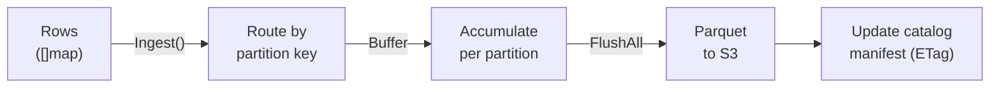

# Ingestion

This guide covers writing data into Caelum — from the built-in micro-batch ingester to production pipelines using Bento.

## Ingestion Overview

Caelum ingests data by:

1. Accepting rows into per-partition memory buffers
2. Automatically flushing buffers to Parquet files on object storage
3. Updating the catalog manifest atomically

Data lands in Parquet format on your S3-compatible store, organized by partition keys.

## Built-in Micro-Batch Ingester

### How It Works



The ingester flushes automatically when any threshold is exceeded:

| Trigger | Default | Description |
|---------|---------|-------------|
| Size | 128 MB | Total buffer size across all partitions |
| Row count | 1,000,000 | Total buffered row count |
| Time | 60 seconds | Wall-clock time since last flush |

### Usage (Go API)

```go
import (
    "github.com/derekmwright/caelum/internal/storage/ingest"
    "github.com/derekmwright/caelum/internal/storage/parquet"
)

schema := parquet.Schema{
    Columns: []parquet.Column{
        {Name: "timestamp", Type: parquet.TypeTimestamp},
        {Name: "device",    Type: parquet.TypeString},
        {Name: "severity",  Type: parquet.TypeString},
        {Name: "message",   Type: parquet.TypeString},
        {Name: "src_ip",    Type: parquet.TypeIPv4},
    },
}

// NewIngester returns *ingest.Ingester (no error)
ingester := db.NewIngester("syslog", schema, []string{"date", "device"}, ingest.Config{
    FlushInterval: 30 * time.Second,
    MaxBufferRows: 500000,
})

// Start background flush goroutine
ingester.Start()

// Ingest rows as batches — ingester handles partitioning and buffering
batch := make([]map[string]any, 0, len(events))
for _, event := range events {
    batch = append(batch, map[string]any{
        "timestamp": event.Time,
        "device":    event.Hostname,
        "severity":  event.Severity,
        "message":   event.Message,
        "src_ip":    event.SourceIP,
    })
}
err := ingester.Ingest(ctx, batch)

// Explicit flush (also happens automatically on thresholds)
ingester.FlushAll(ctx)

// Stop when done
ingester.Stop(ctx)
```

### Partitioning Strategy

Partition keys determine how data is organized on storage:

```
s3://caelum/data/syslog/date=2026-03-15/device=fw-01/part-0001.parquet
s3://caelum/data/syslog/date=2026-03-15/device=sw-02/part-0002.parquet
s3://caelum/data/syslog/date=2026-03-14/device=fw-01/part-0003.parquet
```

Good partitioning enables **partition pruning** — the query engine skips entire partitions that don't match the WHERE clause.

**Recommendations:**

| Workload | Partition Keys | Why |
|----------|---------------|-----|
| Time-series logs | `date` | Most queries filter by time range |
| Multi-tenant | `tenant_id`, `date` | Isolate tenant data, time-range scans |
| Network monitoring | `date`, `device` | Filter by device and time |
| Per-region analytics | `region`, `date` | Region-scoped queries |

Avoid over-partitioning (too many small files) or under-partitioning (single giant partitions). A good target is partition files between 64 MB and 256 MB.

## Bento Integration

[Bento](https://warpstreamlabs.github.io/bento/) (formerly Benthos) is a stream processing tool that fits naturally as the ingestion layer in front of Caelum. Bento handles parsing, enrichment, and batching, then writes Parquet directly to S3.

### Why Bento + Caelum

```
Device Logs ──► Bento (parse, enrich, partition) ──► S3 (Parquet) ──► Caelum (query)
```

- **Bento** handles the messy real-world ingestion: syslog parsing, JSON decoding, field extraction, enrichment, batching, retries
- **Caelum** handles the analytical query layer: SQL, aggregation, joins, API serving

This separation keeps each component focused and independently scalable.

### Syslog to Caelum via Bento

```yaml
# bento-syslog.yaml
input:
  socket_server:
    network: udp
    address: 0.0.0.0:5514
    codec: lines

pipeline:
  processors:
    # Parse RFC5424 syslog
    - mapping: |
        let parsed = this.parse_log("syslog_rfc5424")
        root.timestamp = $parsed.timestamp
        root.hostname = $parsed.hostname
        root.app_name = $parsed.app_name
        root.severity = $parsed.severity
        root.facility = $parsed.facility
        root.message = $parsed.message
        root.date = $parsed.timestamp.format_timestamp("2006-01-02")

    # Extract source IP from message if present
    - mapping: |
        root = this
        let ip_match = this.message.re_find("SRC=([0-9.]+)")
        root.src_ip = if $ip_match != "" { $ip_match } else { "0.0.0.0" }

output:
  aws_s3:
    bucket: caelum
    path: 'data/syslog/date=${! this.date }/part-${! uuid_v4() }.parquet'
    batching:
      count: 100000
      period: 30s
    codec: parquet
    parquet_encoding:
      schema:
        - name: timestamp
          type: INT64
          annotation: TIMESTAMP_MILLIS
        - name: hostname
          type: UTF8
        - name: app_name
          type: UTF8
        - name: severity
          type: UTF8
        - name: facility
          type: UTF8
        - name: message
          type: UTF8
        - name: src_ip
          type: UTF8
        - name: date
          type: UTF8
    region: us-east-1
    endpoint: http://localhost:9000
    credentials:
      id: minioadmin
      secret: minioadmin
    force_path_style_urls: true
```

Run it:

```bash
bento -c bento-syslog.yaml
```

### SNMP Trap Collection

```yaml
# bento-snmp.yaml
input:
  socket_server:
    network: udp
    address: 0.0.0.0:1162
    codec: lines

pipeline:
  processors:
    - mapping: |
        root.timestamp = now()
        root.date = now().format_timestamp("2006-01-02")
        let fields = this.split(" ")
        root.device = $fields.index(0)
        root.oid = $fields.index(1)
        root.value = $fields.index(2)
        root.trap_type = match $fields.index(1) {
          ".1.3.6.1.6.3.1.1.5.3" => "linkDown",
          ".1.3.6.1.6.3.1.1.5.4" => "linkUp",
          ".1.3.6.1.4.1.*" => "vendor",
          _ => "unknown",
        }

output:
  aws_s3:
    bucket: caelum
    path: 'data/snmp_traps/date=${! this.date }/part-${! uuid_v4() }.parquet'
    batching:
      count: 50000
      period: 60s
    codec: parquet
    parquet_encoding:
      schema:
        - name: timestamp
          type: INT64
          annotation: TIMESTAMP_MILLIS
        - name: device
          type: UTF8
        - name: oid
          type: UTF8
        - name: value
          type: UTF8
        - name: trap_type
          type: UTF8
        - name: date
          type: UTF8
    region: us-east-1
    endpoint: http://localhost:9000
    credentials:
      id: minioadmin
      secret: minioadmin
    force_path_style_urls: true
```

### NetFlow/IPFIX via Bento

```yaml
# bento-netflow.yaml
input:
  # Use a NetFlow collector that outputs JSON (e.g., goflow2)
  # goflow2 -transport.type kafka -transport.kafka.brokers localhost:9092
  kafka:
    addresses:
      - localhost:9092
    topics:
      - netflow
    consumer_group: caelum-ingest

pipeline:
  processors:
    - mapping: |
        root.timestamp = this.TimeReceived
        root.date = (this.TimeReceived / 1000).format_timestamp("2006-01-02")
        root.src_ip = this.SrcAddr
        root.dst_ip = this.DstAddr
        root.src_port = this.SrcPort
        root.dst_port = this.DstPort
        root.protocol = match this.Proto {
          6 => "TCP",
          17 => "UDP",
          1 => "ICMP",
          _ => this.Proto.string(),
        }
        root.bytes = this.Bytes
        root.packets = this.Packets
        root.tcp_flags = this.TCPFlags
        root.exporter = this.SamplerAddress

output:
  aws_s3:
    bucket: caelum
    path: 'data/netflow/date=${! this.date }/part-${! uuid_v4() }.parquet'
    batching:
      count: 250000
      period: 30s
    codec: parquet
    parquet_encoding:
      schema:
        - name: timestamp
          type: INT64
          annotation: TIMESTAMP_MILLIS
        - name: src_ip
          type: UTF8
        - name: dst_ip
          type: UTF8
        - name: src_port
          type: INT32
        - name: dst_port
          type: INT32
        - name: protocol
          type: UTF8
        - name: bytes
          type: INT64
        - name: packets
          type: INT64
        - name: tcp_flags
          type: INT32
        - name: exporter
          type: UTF8
        - name: date
          type: UTF8
    region: us-east-1
    endpoint: http://localhost:9000
    credentials:
      id: minioadmin
      secret: minioadmin
    force_path_style_urls: true
```

### Registering Bento-Written Tables in Caelum

After Bento starts writing Parquet files to S3, register the table schema in Caelum so it can be queried:

```go
import (
    "github.com/derekmwright/caelum/internal/storage/objstore"
    "github.com/derekmwright/caelum/internal/storage/parquet"
    "github.com/derekmwright/caelum/pkg/caelum"
)

store, _ := objstore.NewMinIOStore(ctx, objstore.MinIOConfig{
    Endpoint: "localhost:9000", AccessKey: "minioadmin", SecretKey: "minioadmin",
})
db, _ := caelum.Open(ctx, caelum.Config{Store: store, Bucket: "caelum"})

// Register the syslog table
db.CreateTable(ctx, "syslog", parquet.Schema{
    Columns: []parquet.Column{
        {Name: "timestamp", Type: parquet.TypeTimestamp},
        {Name: "hostname",  Type: parquet.TypeString},
        {Name: "app_name",  Type: parquet.TypeString},
        {Name: "severity",  Type: parquet.TypeString},
        {Name: "facility",  Type: parquet.TypeString},
        {Name: "message",   Type: parquet.TypeString},
        {Name: "src_ip",    Type: parquet.TypeString},  // String since Bento writes UTF8
    },
}, []string{"date"})

// Register the netflow table
db.CreateTable(ctx, "netflow", parquet.Schema{
    Columns: []parquet.Column{
        {Name: "timestamp", Type: parquet.TypeTimestamp},
        {Name: "src_ip",    Type: parquet.TypeString},
        {Name: "dst_ip",    Type: parquet.TypeString},
        {Name: "src_port",  Type: parquet.TypeInt32},
        {Name: "dst_port",  Type: parquet.TypeInt32},
        {Name: "protocol",  Type: parquet.TypeString},
        {Name: "bytes",     Type: parquet.TypeInt64},
        {Name: "packets",   Type: parquet.TypeInt64},
        {Name: "tcp_flags", Type: parquet.TypeInt32},
        {Name: "exporter",  Type: parquet.TypeString},
    },
}, []string{"date"})
```

Or via the HTTP API, create tables, then start querying.

## Ingestion Best Practices

### File Sizing

| File Size | Outcome |
|-----------|---------|
| < 16 MB | Too many small files — high S3 LIST overhead, slow scans |
| 64–256 MB | Ideal range — balanced between parallelism and I/O efficiency |
| > 512 MB | Too large — limits parallelism, slow retries on failure |

Tune Bento's `batching.count` and `batching.period` to hit the sweet spot.

### Compression Selection

| Use Case | Codec | Bento Config |
|----------|-------|-------------|
| Real-time dashboards (low latency) | Snappy or LZ4 | Default |
| Archival / cold storage | Zstd | `compression: zstd` |
| Cross-tool compatibility | Gzip | `compression: gzip` |

### Partition Key Selection

- Always include a time dimension (`date`, `hour`) — it's the most common filter
- Add a second key only if queries consistently filter on it (e.g., `device`, `region`)
- Avoid high-cardinality partition keys (e.g., `user_id` with millions of users) — creates millions of tiny partitions

### Exactly-Once Considerations

Caelum's catalog uses optimistic concurrency (ETags), so concurrent writers won't corrupt the catalog. However, if an ingestion process crashes mid-flush, a Parquet file may exist on S3 without a corresponding catalog entry. On restart, the file becomes orphaned but doesn't affect queries. Periodic cleanup of orphaned files is recommended for production deployments.
