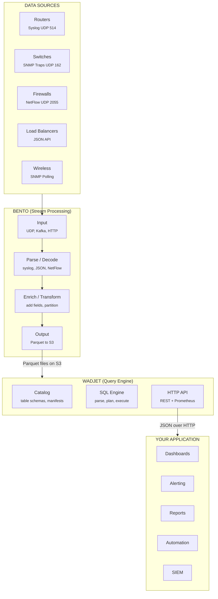

# Network Analytics Workflow

This guide walks through the complete end-to-end pipeline: collecting network device logs, processing them through Bento, querying with Wadjet, and integrating with custom applications.

## Pipeline Overview



## Step 1: Set Up Infrastructure

### MinIO (Object Storage)

```bash
docker run -d --name minio \
  -p 9000:9000 -p 9001:9001 \
  -e MINIO_ROOT_USER=minioadmin \
  -e MINIO_ROOT_PASSWORD=minioadmin \
  -v /data/minio:/data \
  minio/minio server /data --console-address ":9001"

# Create the bucket
mc alias set local http://localhost:9000 minioadmin minioadmin
mc mb local/wadjet
```

### Wadjet Server

```bash
./wadjet serve \
  --mode standalone \
  --http-addr :8080 \
  --endpoint localhost:9000 \
  --access-key minioadmin \
  --secret-key minioadmin \
  --bucket wadjet \
  --config wadjet.yaml
```

## Step 2: Configure Bento Pipelines

### Firewall Syslog Pipeline

Collects syslog from firewalls, parses structured fields, writes Parquet to S3.

```yaml
# bento-firewall-syslog.yaml
input:
  socket_server:
    network: udp
    address: 0.0.0.0:5514
    codec: lines

pipeline:
  processors:
    # Parse syslog header
    - mapping: |
        let parsed = this.parse_log("syslog_rfc5424")
        root.timestamp = $parsed.timestamp
        root.device = $parsed.hostname
        root.app = $parsed.app_name
        root.severity = $parsed.severity
        root.raw_message = $parsed.message
        root.day = $parsed.timestamp.format_timestamp("2006-01-02")

    # Extract firewall-specific fields from the message body
    # Example: "SRC=10.0.1.5 DST=192.168.1.100 PROTO=TCP SPT=54321 DPT=443 ACTION=ALLOW"
    - mapping: |
        root = this
        let msg = this.raw_message
        root.src_ip = $msg.re_find_all("SRC=([0-9.]+)").index(0).or("0.0.0.0")
        root.dst_ip = $msg.re_find_all("DST=([0-9.]+)").index(0).or("0.0.0.0")
        root.protocol = $msg.re_find_all("PROTO=(\\w+)").index(0).or("UNKNOWN")
        root.src_port = $msg.re_find_all("SPT=(\\d+)").index(0).or("0").number()
        root.dst_port = $msg.re_find_all("DPT=(\\d+)").index(0).or("0").number()
        root.action = $msg.re_find_all("ACTION=(\\w+)").index(0).or("UNKNOWN")

    # Classify traffic
    - mapping: |
        root = this
        root.traffic_class = match this.dst_port {
          443 => "HTTPS",
          80 => "HTTP",
          53 => "DNS",
          22 => "SSH",
          25 => "SMTP",
          _ => "OTHER",
        }

output:
  aws_s3:
    bucket: wadjet
    path: 'tables/firewall_logs/day=${! this.day }/device=${! this.device }/part-${! uuid_v4() }.parquet'
    batching:
      count: 100000
      period: 30s
    codec: parquet
    parquet_encoding:
      schema:
        - name: timestamp
          type: INT64
          annotation: TIMESTAMP_MILLIS
        - name: device
          type: UTF8
        - name: severity
          type: UTF8
        - name: src_ip
          type: UTF8
        - name: dst_ip
          type: UTF8
        - name: protocol
          type: UTF8
        - name: src_port
          type: INT32
        - name: dst_port
          type: INT32
        - name: action
          type: UTF8
        - name: traffic_class
          type: UTF8
        - name: raw_message
          type: UTF8
        - name: day
          type: UTF8
    region: us-east-1
    endpoint: http://localhost:9000
    credentials:
      id: minioadmin
      secret: minioadmin
    force_path_style_urls: true
```

### Switch/Router NetFlow Pipeline

```yaml
# bento-netflow.yaml
input:
  kafka:
    addresses:
      - kafka.internal:9092
    topics:
      - netflow-v9
    consumer_group: wadjet-netflow

pipeline:
  processors:
    - mapping: |
        root.timestamp = this.TimeReceived
        root.day = (this.TimeReceived / 1000).format_timestamp("2006-01-02")
        root.src_ip = this.SrcAddr
        root.dst_ip = this.DstAddr
        root.src_port = this.SrcPort
        root.dst_port = this.DstPort
        root.protocol = match this.Proto {
          6 => "TCP", 17 => "UDP", 1 => "ICMP", 47 => "GRE", _ => this.Proto.string()
        }
        root.bytes = this.Bytes
        root.packets = this.Packets
        root.tcp_flags = this.TCPFlags
        root.tos = this.Tos
        root.input_snmp = this.InIf
        root.output_snmp = this.OutIf
        root.exporter = this.SamplerAddress
        root.next_hop = this.NextHop
        root.src_as = this.SrcAS
        root.dst_as = this.DstAS

output:
  aws_s3:
    bucket: wadjet
    path: 'tables/netflow/day=${! this.day }/exporter=${! this.exporter }/part-${! uuid_v4() }.parquet'
    batching:
      count: 250000
      period: 30s
    codec: parquet
    parquet_encoding:
      schema:
        - name: timestamp
          type: INT64
          annotation: TIMESTAMP_MILLIS
        - name: src_ip
          type: UTF8
        - name: dst_ip
          type: UTF8
        - name: src_port
          type: INT32
        - name: dst_port
          type: INT32
        - name: protocol
          type: UTF8
        - name: bytes
          type: INT64
        - name: packets
          type: INT64
        - name: tcp_flags
          type: INT32
        - name: tos
          type: INT32
        - name: input_snmp
          type: INT32
        - name: output_snmp
          type: INT32
        - name: exporter
          type: UTF8
        - name: next_hop
          type: UTF8
        - name: src_as
          type: INT64
        - name: dst_as
          type: INT64
        - name: day
          type: UTF8
    region: us-east-1
    endpoint: http://localhost:9000
    credentials:
      id: minioadmin
      secret: minioadmin
    force_path_style_urls: true
```

### Device Inventory Sync

Periodically pull device inventory from your CMDB/NMS and load it as a lookup table:

```yaml
# bento-device-inventory.yaml
input:
  generate:
    interval: 1h
    mapping: 'root = ""'

pipeline:
  processors:
    # Fetch device inventory from your NMS/CMDB API
    - http:
        url: http://nms.internal/api/v1/devices
        verb: GET
        headers:
          Authorization: "Bearer ${NMS_API_KEY}"
    - unarchive:
        format: json_array
    - mapping: |
        root.ip_address = this.management_ip
        root.hostname = this.hostname
        root.vendor = this.vendor
        root.model = this.model
        root.os_version = this.os_version
        root.location = this.site_name
        root.role = this.device_role
        root.region = this.region
        root.environment = this.environment
        root.last_seen = now()

output:
  aws_s3:
    bucket: wadjet
    path: 'tables/device_inventory/snapshot-${! now().format_timestamp("2006-01-02T15-04-05") }.parquet'
    codec: parquet
    parquet_encoding:
      schema:
        - name: ip_address
          type: UTF8
        - name: hostname
          type: UTF8
        - name: vendor
          type: UTF8
        - name: model
          type: UTF8
        - name: os_version
          type: UTF8
        - name: location
          type: UTF8
        - name: role
          type: UTF8
        - name: region
          type: UTF8
        - name: environment
          type: UTF8
        - name: last_seen
          type: INT64
          annotation: TIMESTAMP_MILLIS
    region: us-east-1
    endpoint: http://localhost:9000
    credentials:
      id: minioadmin
      secret: minioadmin
    force_path_style_urls: true
```

## Step 3: Register Tables in Wadjet

After Bento starts writing data, register the tables so Wadjet can query them.

> **Registration still needs code inside this repository**, for one reason
> rather than the three that used to apply:
>
> 1. `wadjet.Open` with no `MetaKV` gets an in-memory catalog. Anything it
>    registers dies with the process and is invisible to `wadjet serve`, whose
>    catalog is NATS-backed. Pass `Config.MetaKV` built from the same NATS
>    JetStream the server uses — and `MetaKV` has no out-of-tree constructor,
>    which is what keeps this program in-repo.
> 2. `CreateTable` writes an EMPTY manifest. Queries resolve data files from
>    the manifest only — there is no prefix discovery — so Bento-written
>    objects must additionally be registered with `catalog.AddFiles`.
>    Registered paths must sit under `tables/<name>/`.

```go
// register_tables.go
package main

import (
    "context"
    "log"

    "github.com/derekmwright/wadjet/wadjet"
)

func main() {
    ctx := context.Background()

    store, err := wadjet.NewS3Store(wadjet.S3Config{
        Endpoint:  "localhost:9000",
        AccessKey: "minioadmin",
        SecretKey: "minioadmin",
    })
    if err != nil {
        log.Fatal(err)
    }

    db, err := wadjet.Open(ctx, wadjet.Config{
        Store:  store,
        Bucket: "wadjet",
    })
    if err != nil {
        log.Fatal(err)
    }

    // Firewall logs
    db.CreateTable(ctx, "firewall_logs", wadjet.Schema{
        Columns: []wadjet.Column{
            {Name: "timestamp", Type: wadjet.TypeTimestamp},
            {Name: "device", Type: wadjet.TypeString},
            {Name: "severity", Type: wadjet.TypeString},
            {Name: "src_ip", Type: wadjet.TypeString},
            {Name: "dst_ip", Type: wadjet.TypeString},
            {Name: "protocol", Type: wadjet.TypeString},
            {Name: "src_port", Type: wadjet.TypeInt32},
            {Name: "dst_port", Type: wadjet.TypeInt32},
            {Name: "action", Type: wadjet.TypeString},
            {Name: "traffic_class", Type: wadjet.TypeString},
            {Name: "raw_message", Type: wadjet.TypeString},
        },
    }, []string{"day", "device"})

    // NetFlow
    db.CreateTable(ctx, "netflow", wadjet.Schema{
        Columns: []wadjet.Column{
            {Name: "timestamp", Type: wadjet.TypeTimestamp},
            {Name: "src_ip", Type: wadjet.TypeString},
            {Name: "dst_ip", Type: wadjet.TypeString},
            {Name: "src_port", Type: wadjet.TypeInt32},
            {Name: "dst_port", Type: wadjet.TypeInt32},
            {Name: "protocol", Type: wadjet.TypeString},
            {Name: "bytes", Type: wadjet.TypeInt64},
            {Name: "packets", Type: wadjet.TypeInt64},
            {Name: "tcp_flags", Type: wadjet.TypeInt32},
            {Name: "tos", Type: wadjet.TypeInt32},
            {Name: "input_snmp", Type: wadjet.TypeInt32},
            {Name: "output_snmp", Type: wadjet.TypeInt32},
            {Name: "exporter", Type: wadjet.TypeString},
            {Name: "next_hop", Type: wadjet.TypeString},
            {Name: "src_as", Type: wadjet.TypeInt64},
            {Name: "dst_as", Type: wadjet.TypeInt64},
        },
    }, []string{"day", "exporter"})

    // Device inventory
    db.CreateTable(ctx, "device_inventory", wadjet.Schema{
        Columns: []wadjet.Column{
            {Name: "ip_address", Type: wadjet.TypeString},
            {Name: "hostname", Type: wadjet.TypeString},
            {Name: "vendor", Type: wadjet.TypeString},
            {Name: "model", Type: wadjet.TypeString},
            {Name: "os_version", Type: wadjet.TypeString},
            {Name: "location", Type: wadjet.TypeString},
            {Name: "role", Type: wadjet.TypeString},
            {Name: "region", Type: wadjet.TypeString},
            {Name: "environment", Type: wadjet.TypeString},
            {Name: "last_seen", Type: wadjet.TypeTimestamp},
        },
    }, nil)

    log.Println("Tables registered successfully")
}
```

## Step 4: Query Network Data

### Via the Interactive Shell

```bash
./wadjet shell --endpoint localhost:9000 --access-key minioadmin --secret-key minioadmin --bucket wadjet
```

```sql
-- Top denied connections by source
wadjet> SELECT src_ip, COUNT(*) AS denied
        FROM firewall_logs
        WHERE day = '2026-03-15' AND action = 'DENY'
        GROUP BY src_ip
        ORDER BY denied DESC
        LIMIT 20;

-- Bandwidth by AS path
wadjet> SELECT src_as, dst_as, SUM(bytes) AS total_bytes, SUM(packets) AS total_pkts
        FROM netflow
        WHERE day = '2026-03-15'
        GROUP BY src_as, dst_as
        ORDER BY total_bytes DESC
        LIMIT 25;

-- Join flow data with device inventory
wadjet> SELECT d.hostname, d.location, d.role,
               SUM(n.bytes) AS total_bytes,
               COUNT(*) AS flow_count
        FROM netflow n
        JOIN device_inventory d ON n.exporter = d.ip_address
        WHERE n.day = '2026-03-15'
        GROUP BY d.hostname, d.location, d.role
        ORDER BY total_bytes DESC;
```

### TCP Flags

A flow record's TCP flags are an integer bitset. Wadjet names the bits, so a
predicate says what it means instead of spelling a mask. Bits 0-7 are the
control bits RFC 9293 §3.1 defines; bit 8 is the bit RFC 3540 named `NS`
(Historic per RFC 8311), which the Accurate ECN work reuses as `AE`:

| Bit | Value | Name | Meaning |
|---|---|---|---|
| 0 | 1 | `FIN` | Sender has finished sending |
| 1 | 2 | `SYN` | Synchronize sequence numbers |
| 2 | 4 | `RST` | Reset the connection |
| 3 | 8 | `PSH` | Push buffered data to the application |
| 4 | 16 | `ACK` | Acknowledgement field is significant |
| 5 | 32 | `URG` | Urgent pointer field is significant |
| 6 | 64 | `ECE` | ECN-Echo |
| 7 | 128 | `CWR` | Congestion window reduced |
| 8 | 256 | `AE` | Accurate ECN — RFC 3540 named this bit `NS`; both spellings are accepted |

Six functions, over any `INT32` or `INT64` column:

| Function | Answers | Equivalent bit arithmetic |
|---|---|---|
| `TCP_FLAGS_HAS_ALL(flags, name, ...)` | `BOOLEAN` — every named bit is set | `(flags & mask) = mask` |
| `TCP_FLAGS_HAS_ANY(flags, name, ...)` | `BOOLEAN` — at least one named bit is set | `(flags & mask) <> 0` |
| `TCP_FLAGS_HAS_NONE(flags, name, ...)` | `BOOLEAN` — no named bit is set | `(flags & mask) = 0` |
| `TCP_FLAG_MASK(name, ...)` | `INTEGER` — the mask those names denote | — |
| `TCP_FLAGS(flags)` | the set bits as an array of names, in header bit order | — |
| `TCP_FLAGS_TEXT(flags)` | the same names joined with a pipe, e.g. `SYN\|ACK` | — |

Names are case-insensitive and `NS` is accepted for `AE`. **An unrecognized
name is an error** (SQLSTATE `22023`) naming it, never a quietly smaller mask —
`TCP_FLAGS_HAS_ALL(flags,'SYN','ACKK')` would otherwise mean
`TCP_FLAGS_HAS_ALL(flags,'SYN')` and match a larger set of flows than the query
asked for. An empty name list is `22023` too. NULL flags give NULL, so a flow
with no recorded flags matches none of the three predicates — including
`HAS_NONE`.

When the two meet, **the name wins**: `TCP_FLAGS_HAS_ALL(flags,'ACKK')` is
`22023` even on a row whose `flags` is NULL, so a typo is an error whatever the
data holds rather than an error on some rows and a NULL on others. A NULL
*name* is different — that is a NULL mask, and the call is NULL. This follows
PostgreSQL, which raises for the operator equivalent whatever the rows are:
`SELECT NULL::bigint & 'x'::bigint` is `22P02`, and so is `'x'::int` under
`WHERE false`.

The refusal is raised per ROW, as PostgreSQL's `DATE_TRUNC` raises its unknown
unit, so a predicate that no row reaches answers zero rows rather than an
error. A flag name may also be a column or any other text expression; only
literal names are folded at plan time and pushed into the scan.

```sql
-- SYN without ACK: connection attempts, the first half of a handshake
wadjet> SELECT src_ip, dst_ip, dst_port, COUNT(*) AS attempts
        FROM netflow
        WHERE day = '2026-03-15'
          AND TCP_FLAGS_HAS_ALL(tcp_flags, 'SYN')
          AND TCP_FLAGS_HAS_NONE(tcp_flags, 'ACK')
        GROUP BY src_ip, dst_ip, dst_port
        ORDER BY attempts DESC
        LIMIT 20;

-- Horizontal scan: one source, many destination ports, all SYN-only
wadjet> SELECT src_ip, COUNT(DISTINCT dst_port) AS ports
        FROM netflow
        WHERE day = '2026-03-15'
          AND TCP_FLAGS_HAS_ALL(tcp_flags, 'SYN')
          AND TCP_FLAGS_HAS_NONE(tcp_flags, 'ACK')
        GROUP BY src_ip
        HAVING COUNT(DISTINCT dst_port) > 100
        ORDER BY ports DESC;

-- Resets by peer: connections refused or torn down
wadjet> SELECT dst_ip, COUNT(*) AS resets
        FROM netflow
        WHERE day = '2026-03-15' AND TCP_FLAGS_HAS_ANY(tcp_flags, 'RST')
        GROUP BY dst_ip
        ORDER BY resets DESC
        LIMIT 20;

-- The flag combinations actually seen, as a histogram
wadjet> SELECT TCP_FLAGS_TEXT(tcp_flags) AS flags, COUNT(*) AS flows
        FROM netflow
        WHERE day = '2026-03-15'
        GROUP BY 1
        ORDER BY flows DESC;

-- Congestion signalling, which needs the bits above the first byte
wadjet> SELECT COUNT(*) AS ecn_flows
        FROM netflow
        WHERE day = '2026-03-15' AND TCP_FLAGS_HAS_ANY(tcp_flags, 'ECE', 'CWR', 'AE');
```

**Pushdown.** A `TCP_FLAGS_HAS_*` predicate over a bare column with literal
names is evaluated inside the scan, and so is the `BITWISE_AND(flags, 18) = 18`
spelling of the same test. The flags column's values are never materialized
when the filter is the only thing that reads them. Set
`WADJET_FLAG_DICT_PUSHDOWN=0` to disable the pushdown.

How much that saves depends on how the file was ENCODED, and the two cases are
worth stating separately because only one of them is reachable today:

- **A dictionary-encoded flags column** — what Spark, PyArrow and most Parquet
  writers produce for a low-cardinality integer column — has the mask evaluated
  once per DICTIONARY ENTRY and applied per run of row indices, so a row group
  costs a handful of comparisons instead of one per row.
- **A plain-encoded column** has it evaluated per value, which still skips the
  materialization but not the per-row comparison.

Wadjet's own writer does not emit dictionary pages today, so a table ingested
through Wadjet takes the second path; the first applies to Parquet files
written elsewhere and registered here.

A flag predicate does no *pruning before it is evaluated*: a min/max range
cannot prove anything about a bit (`min=2, max=16` still admits a row holding
18), and the dictionary-probe prune answers "is this exact value absent",
which says nothing about a mask — so neither is attempted and
`StatsPrunedRowGroupsSnapshot` never moves for a flag conjunct.

A row group can still be skipped *after* the predicate has run: once the scan
has evaluated the flag column over a group and found no matching row, it drops
the whole group and counts it in the scan filter's own `skipped` counter. That
is the ordinary post-evaluation skip every pushed predicate gets, and it is a
different claim from a prune — a prune decides without reading the values,
which is what a bit test cannot do.

### Via HTTP API

```bash
# Firewall deny rate by hour
curl -s -X POST http://localhost:8080/v1/queries \
  -H "Content-Type: application/json" \
  -d '{
    "sql": "SELECT date_trunc('\''hour'\'', timestamp) AS hour, COUNT(*) AS denies FROM firewall_logs WHERE day = '\''2026-03-15'\'' AND action = '\''DENY'\'' GROUP BY date_trunc('\''hour'\'', timestamp) ORDER BY hour"
  }' | jq .
```

## Step 5: Build Application Integrations

### Python Dashboard Backend

```python
import requests
from datetime import date, timedelta
from flask import Flask, jsonify

app = Flask(__name__)
WADJET = "http://localhost:8080"

def wadjet_query(sql: str) -> list:
    resp = requests.post(f"{WADJET}/v1/queries", json={"sql": sql})
    resp.raise_for_status()
    return resp.json()["rows"]

@app.route("/api/dashboard/overview")
def dashboard_overview():
    today = date.today().isoformat()

    # Run multiple queries for the dashboard
    top_talkers = wadjet_query(f"""
        SELECT src_ip, SUM(bytes) AS total_bytes, COUNT(*) AS flows
        FROM netflow WHERE day = '{today}'
        GROUP BY src_ip ORDER BY total_bytes DESC LIMIT 10
    """)

    denied_connections = wadjet_query(f"""
        SELECT src_ip, dst_ip, dst_port, COUNT(*) AS attempts
        FROM firewall_logs
        WHERE day = '{today}' AND action = 'DENY'
        GROUP BY src_ip, dst_ip, dst_port
        ORDER BY attempts DESC LIMIT 10
    """)

    traffic_by_protocol = wadjet_query(f"""
        SELECT protocol, SUM(bytes) AS total_bytes, COUNT(*) AS flows
        FROM netflow WHERE day = '{today}'
        GROUP BY protocol ORDER BY total_bytes DESC
    """)

    return jsonify({
        "day": today,
        "top_talkers": top_talkers,
        "denied_connections": denied_connections,
        "traffic_by_protocol": traffic_by_protocol,
    })

@app.route("/api/dashboard/device/<hostname>")
def device_detail(hostname):
    today = date.today().isoformat()

    device_info = wadjet_query(f"""
        SELECT * FROM device_inventory WHERE hostname = '{hostname}' LIMIT 1
    """)

    device_traffic = wadjet_query(f"""
        SELECT
            n.dst_ip, n.dst_port, n.protocol,
            SUM(n.bytes) AS total_bytes, COUNT(*) AS flows
        FROM netflow n
        JOIN device_inventory d ON n.exporter = d.ip_address
        WHERE d.hostname = '{hostname}' AND n.day = '{today}'
        GROUP BY n.dst_ip, n.dst_port, n.protocol
        ORDER BY total_bytes DESC LIMIT 50
    """)

    return jsonify({
        "device": device_info[0] if device_info else None,
        "traffic": device_traffic,
    })

if __name__ == "__main__":
    app.run(port=9090)
```

### Go Alerting Service

```go
// alerting.go — monitors Wadjet for anomalous patterns and sends alerts
package main

import (
    "context"
    "fmt"
    "log"
    "time"

    "github.com/derekmwright/wadjet/wadjet"
)

type Alert struct {
    Severity string
    Title    string
    Detail   string
    Time     time.Time
}

func main() {
    ctx := context.Background()
    store, _ := wadjet.NewS3Store(wadjet.S3Config{
        Endpoint:  "localhost:9000",
        AccessKey: "minioadmin",
        SecretKey: "minioadmin",
    })
    db, _ := wadjet.Open(ctx, wadjet.Config{
        Store:  store,
        Bucket: "wadjet",
    })

    ticker := time.NewTicker(5 * time.Minute)
    for range ticker.C {
        alerts := runChecks(ctx, db)
        for _, alert := range alerts {
            sendAlert(alert) // Implement: Slack, PagerDuty, email, etc.
        }
    }
}

func runChecks(ctx context.Context, db *wadjet.DB) []Alert {
    var alerts []Alert
    today := time.Now().Format("2006-01-02")

    // Check 1: Port scan detection
    result, _ := db.Query(ctx, fmt.Sprintf(`
        SELECT src_ip, COUNT(DISTINCT dst_port) AS ports, COUNT(*) AS flows
        FROM firewall_logs
        WHERE day = '%s' AND action = 'DENY'
        GROUP BY src_ip
        HAVING COUNT(DISTINCT dst_port) > 100
    `, today))
    for _, row := range result.Rows {
        alerts = append(alerts, Alert{
            Severity: "HIGH",
            Title:    fmt.Sprintf("Port scan detected from %s", row["src_ip"]),
            Detail:   fmt.Sprintf("%v unique ports probed, %v total flows", row["ports"], row["flows"]),
            Time:     time.Now(),
        })
    }

    // Check 2: Unusual outbound traffic volume
    result, _ = db.Query(ctx, fmt.Sprintf(`
        SELECT src_ip, SUM(bytes) AS total_bytes
        FROM netflow
        WHERE day = '%s'
        GROUP BY src_ip
        HAVING SUM(bytes) > 10737418240
    `, today)) // > 10 GB
    for _, row := range result.Rows {
        alerts = append(alerts, Alert{
            Severity: "MEDIUM",
            Title:    fmt.Sprintf("High traffic volume from %s", row["src_ip"]),
            Detail:   fmt.Sprintf("%v bytes transferred today", row["total_bytes"]),
            Time:     time.Now(),
        })
    }

    // Check 3: Denied connections spike
    result, _ = db.Query(ctx, fmt.Sprintf(`
        SELECT COUNT(*) AS deny_count
        FROM firewall_logs
        WHERE day = '%s' AND action = 'DENY'
    `, today))
    if len(result.Rows) > 0 {
        if count, ok := result.Rows[0]["deny_count"].(int64); ok && count > 100000 {
            alerts = append(alerts, Alert{
                Severity: "HIGH",
                Title:    "Firewall deny spike",
                Detail:   fmt.Sprintf("%d denied connections today (threshold: 100,000)", count),
                Time:     time.Now(),
            })
        }
    }

    return alerts
}

func sendAlert(a Alert) {
    log.Printf("[%s] %s: %s — %s", a.Severity, a.Time.Format(time.RFC3339), a.Title, a.Detail)
    // TODO: integrate with Slack, PagerDuty, OpsGenie, etc.
}
```

### Grafana Integration

Wadjet's HTTP API can be used as a JSON data source in Grafana via the [JSON API plugin](https://grafana.com/grafana/plugins/marcusolsson-json-datasource/):

1. Install the Grafana JSON API data source plugin
2. Add a new data source:
   - **URL**: `http://wadjet.internal:8080`
   - **Custom headers**: `Authorization: Bearer <api-key>`
3. Create a dashboard panel with a query like:

```
POST /v1/queries
{
  "sql": "SELECT date_trunc('hour', timestamp) AS time, SUM(bytes) AS bytes FROM netflow WHERE day = '${__from:date:YYYY-MM-DD}' GROUP BY date_trunc('hour', timestamp) ORDER BY time"
}
```

4. Map the `time` field to the time axis and `bytes` to the value axis

## Step 6: Production Checklist

### Infrastructure
- [ ] S3 storage with replication enabled (MinIO erasure coding or AWS S3 standard)
- [ ] Wadjet deployed in distributed mode with 3+ workers
- [ ] Bento pipelines deployed as systemd services or Kubernetes deployments
- [ ] Reverse proxy (nginx/Caddy) in front of Wadjet with TLS termination

### Data Pipeline
- [ ] Syslog collection configured on all network devices
- [ ] NetFlow/IPFIX export enabled on core routers and switches
- [ ] Bento batching tuned for 64–256 MB Parquet files
- [ ] Partition keys chosen (a prunable time key — `year`/`month`/`day`/`hour` — plus at most one device/region dimension, which organizes storage but does not prune)
- [ ] All tables registered in the Wadjet catalog

### Security
- [ ] Authentication configured (JWT or mTLS for production)
- [ ] Roles defined with least-privilege access
- [ ] Cell-level policies for sensitive fields (source IPs, raw messages)
- [ ] API keys rotated on schedule

### Monitoring
- [ ] Prometheus scraping Wadjet `/metrics` endpoint
- [ ] Grafana dashboards for query latency, rows scanned, error rate
- [ ] Alerting on query failures and high latency
- [ ] Bento pipeline health monitoring

### Operations
- [ ] S3 lifecycle policies for data retention (e.g., 90-day expiry)
- [ ] Orphaned Parquet file cleanup job
- [ ] Backup strategy for the NATS JetStream store (catalog KV)
- [ ] Runbook for common failure scenarios
