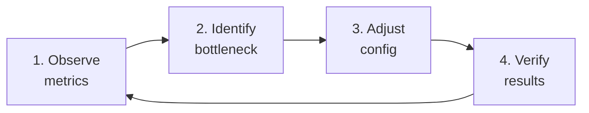

# Performance Tuning

This guide covers how to configure Wadjet for different hardware profiles — from constrained edge nodes to high-spec data center workers — and a systematic methodology for tuning performance using Prometheus metrics.

## Tunable Parameters Overview

| Parameter | CLI Flag | YAML Key | Default | What It Controls |
|-----------|----------|----------|---------|------------------|
| Worker concurrency | `--max-concurrent` | `worker.max_concurrent` | 4 | Parallel tasks per worker |
| LRU cache size | `--cache-bytes` | `worker.cache_bytes` | 0 = auto (10% of memory) | Parquet data cache |
| Memory budget | `--memory-budget` | `worker.memory_budget` | 0 (auto-detect from cgroup, else unlimited) | Per-task memory limit before spilling to disk |
| Spill directory | `--spill-dir` | `worker.spill_dir` | OS temp dir | Where spill files are written |
| Result store | `--result-store` | `worker.result_store_bytes` | 512 MiB | In-memory cache for intermediate stage results (0 = disabled) |
| Parquet compression | — | `parquet.compression` | snappy | Codec for written Parquet files |
| Row group size | — | `parquet.row_group_size` | 131,072 rows (128 K) | Rows per row group |
| Page buffer size | — | `parquet.page_buffer_size` | 256 KB | Parquet page buffer |
| Ingestion flush size | — | (compile-time) | 128 MB | Buffer size before flush |
| Ingestion flush rows | — | (compile-time) | 1,000,000 | Row count before flush |
| Ingestion flush interval | — | (compile-time) | 60s | Max time between flushes |

## Environment Profiles

### Constrained (512 MB - 1 GB RAM)

Edge nodes, Raspberry Pi clusters, small VMs, containers with tight resource limits. Typical use: remote site workers in federated deployments, IoT gateway analytics.

```yaml
# wadjet-constrained.yaml
worker:
  max_concurrent: 2
  cache_bytes: 33554432        # 32 MB
  memory_budget: 67108864      # 64 MB per task — spill early
  spill_dir: /var/wadjet/spill
  result_store_bytes: 16777216 # 16 MB

parquet:
  compression: zstd            # better ratio, save storage/bandwidth
  row_group_size: 65536        # 64K rows — smaller groups, less memory per read
  page_buffer_size: 65536      # 64 KB pages
```

```bash
./wadjet serve --mode worker \
  --nats-url nats://coordinator:4222 \
  --memory-budget 67108864 \
  --spill-dir /var/wadjet/spill \
  --result-store 16777216 \
  --endpoint minio:9000 \
  --access-key $S3_ACCESS_KEY \
  --secret-key $S3_SECRET_KEY \
  --bucket wadjet
```

**Key trade-offs:**
- Low concurrency (2 tasks) prevents memory contention
- 64 MB per-task budget means sorts and aggregations spill to disk for datasets > ~64 MB
- Small cache (32 MB) means more S3 reads on repeated queries
- Zstd compression saves storage and network bandwidth at the cost of slightly higher CPU
- Small result store still avoids S3 round-trips for common small intermediate results

**Kubernetes resource limits:**
```yaml
resources:
  requests:
    cpu: "1"
    memory: 512Mi
  limits:
    cpu: "2"
    memory: 1Gi
```

### Moderate (2 - 4 GB RAM)

Standard cloud VMs (t3.medium, e2-standard-2), typical production workers.

```yaml
# wadjet-moderate.yaml
worker:
  max_concurrent: 4
  cache_bytes: 268435456        # 256 MB
  memory_budget: 268435456      # 256 MB per task
  spill_dir: /var/wadjet/spill
  result_store_bytes: 134217728 # 128 MB

parquet:
  compression: snappy
  row_group_size: 131072        # 128K rows (default)
  page_buffer_size: 262144      # 256 KB (default)
```

```bash
./wadjet serve --mode worker \
  --nats-url nats://coordinator:4222 \
  --memory-budget 268435456 \
  --spill-dir /var/wadjet/spill \
  --result-store 134217728 \
  --endpoint minio:9000 \
  --access-key $S3_ACCESS_KEY \
  --secret-key $S3_SECRET_KEY \
  --bucket wadjet
```

**Key trade-offs:**
- Default concurrency handles typical multi-stage queries well
- 256 MB budget means most single-partition aggregations and sorts stay in memory
- 128 MB result store eliminates S3 round-trips for most multi-stage queries
- Snappy compression balances speed and ratio

**Kubernetes resource limits:**
```yaml
resources:
  requests:
    cpu: "2"
    memory: 2Gi
  limits:
    cpu: "4"
    memory: 4Gi
```

### Unconstrained (8+ GB RAM)

High-spec bare metal, dedicated analytics nodes (m5.2xlarge, n2-highmem-8), data center workers processing heavy workloads.

```yaml
# wadjet-unconstrained.yaml
worker:
  max_concurrent: 8
  cache_bytes: 2147483648        # 2 GB
  memory_budget: 1073741824      # 1 GB per task — spill only for very large datasets
  spill_dir: /nvme/wadjet/spill  # fast NVMe for rare spills
  result_store_bytes: 1073741824 # 1 GB

parquet:
  compression: snappy            # or lz4 for lowest latency
  row_group_size: 262144         # 256K rows — larger groups, better compression
  page_buffer_size: 1048576      # 1 MB pages
```

```bash
./wadjet serve --mode worker \
  --nats-url nats://coordinator:4222 \
  --memory-budget 1073741824 \
  --spill-dir /nvme/wadjet/spill \
  --result-store 1073741824 \
  --endpoint minio:9000 \
  --access-key $S3_ACCESS_KEY \
  --secret-key $S3_SECRET_KEY \
  --bucket wadjet
```

**Key trade-offs:**
- 8 concurrent tasks can saturate S3 bandwidth and CPU
- 1 GB per-task budget keeps most operations entirely in memory — spill is a rare safety net
- 2 GB cache means frequently accessed partitions stay hot across queries
- 1 GB result store means multi-stage queries almost never touch S3 for intermediates
- NVMe spill directory ensures the rare spill event is still fast
- Larger row groups and pages improve compression ratios and sequential read performance

**Kubernetes resource limits:**
```yaml
resources:
  requests:
    cpu: "4"
    memory: 8Gi
  limits:
    cpu: "8"
    memory: 16Gi
```

### Mixed Federation

In federated deployments, different clusters can run different profiles. A central data center uses the unconstrained profile while remote sites use constrained:

```bash
# Central DC worker (8+ GB RAM)
./wadjet serve --mode worker \
  --cluster-id central \
  --nats-url nats://coordinator:4222 \
  --memory-budget 1073741824 \
  --result-store 1073741824 \
  --spill-dir /nvme/wadjet/spill \
  --endpoint minio-central:9000 \
  --access-key $S3_ACCESS_KEY --secret-key $S3_SECRET_KEY --bucket wadjet

# Remote site worker (1 GB RAM)
./wadjet serve --mode worker \
  --cluster-id site-east \
  --leaf-remote nats://coordinator.central:4222 \
  --nats-url nats://local-nats:4222 \
  --memory-budget 67108864 \
  --result-store 16777216 \
  --spill-dir /var/wadjet/spill \
  --endpoint minio-east:9000 \
  --access-key $S3_ACCESS_KEY --secret-key $S3_SECRET_KEY --bucket wadjet
```

The coordinator's federated scan planner automatically routes tasks to the cluster where the data resides. Remote workers process local data with constrained settings, while the central cluster handles the final merge with more resources.

## Tuning Methodology

Follow this observe-identify-adjust-verify loop:



### Step 1: Observe

Collect baseline metrics. Run representative queries and observe:

```promql
# Query latency P50/P99
histogram_quantile(0.50, rate(wadjet_query_duration_seconds_bucket[5m]))
histogram_quantile(0.99, rate(wadjet_query_duration_seconds_bucket[5m]))

# Task latency by type
histogram_quantile(0.99, rate(wadjet_worker_task_duration_seconds_bucket{type="aggregate"}[5m]))

# Scan efficiency (pruning ratio)
rate(wadjet_scan_files_pruned_total[5m]) / (rate(wadjet_scan_files_scanned_total[5m]) + rate(wadjet_scan_files_pruned_total[5m]))

# Cache effectiveness
rate(wadjet_cache_hits_total[5m]) / (rate(wadjet_cache_hits_total[5m]) + rate(wadjet_cache_misses_total[5m]))
```

### Step 2: Identify the Bottleneck

| Symptom | Likely Bottleneck | Key Metrics |
|---------|------------------|-------------|
| High query latency, low CPU | S3 I/O bound | `cache_misses`, `bytes_read` |
| High CPU, spill events | Memory pressure | `spill_events_total`, `memory_used_bytes` |
| High latency, no spills, low cache misses | Concurrency too low | `active_tasks` vs `max_concurrent` |
| Aggregation tasks slow, no spills | Hash table overhead | `task_duration{type=aggregate}` |
| Many files scanned vs pruned | Poor partition strategy | `files_scanned` vs `files_pruned` |
| Multi-stage queries slow | S3 round-trips between stages | result store disabled (0 bytes) |

### Step 3: Adjust

**If S3 I/O bound (high cache misses):**
```yaml
worker:
  cache_bytes: 536870912  # double the cache (512 MB → 1 GB)
```

**If memory pressure (frequent spills):**
```yaml
worker:
  memory_budget: 536870912  # increase per-task budget
  # OR reduce concurrency to give each task more headroom:
  max_concurrent: 2
```

**If spilling too rarely (wasting RAM on headroom):**
```yaml
worker:
  memory_budget: 134217728  # lower budget, let spill handle overflow
  max_concurrent: 6         # use freed RAM for more parallelism
```

**If multi-stage queries slow (S3 intermediates):**
```yaml
worker:
  result_store_bytes: 268435456  # 256 MB result store
```

**If scan efficiency low (reading too many files):**
- Review partition keys — add a time dimension if missing
- Review query patterns — ensure WHERE clauses use partition keys

### Step 4: Verify

Re-run the same representative queries and compare:

```promql
# Before/after comparison: P99 query latency
histogram_quantile(0.99, rate(wadjet_query_duration_seconds_bucket[5m]))

# Spill rate should decrease if budget was increased
rate(wadjet_worker_spill_events_total[5m])

# Cache hit ratio should increase if cache was enlarged
rate(wadjet_cache_hits_total[5m]) / (rate(wadjet_cache_hits_total[5m]) + rate(wadjet_cache_misses_total[5m]))
```

## Deep Dive: Memory Budget vs Disk Spill

The `memory_budget` parameter controls the per-task threshold where pipeline breakers (HashJoin, HashAggregate, Sort, Window) spill intermediate state to disk instead of growing memory.

```
memory_budget = 0   → auto-detect a cgroup limit; unlimited only on an uncapped host
memory_budget = 64M → spill after 64 MB per task (conservative, many spills)
memory_budget = 1G  → spill after 1 GB per task (aggressive, rare spills)
```

**How to size it:**
- Start with `total_worker_ram / (max_concurrent * 2)` — this gives each task half the proportional memory, leaving headroom for the Go runtime, cache, and result store
- Example: 4 GB RAM, 4 concurrent tasks → `memory_budget = 4GB / (4 * 2) = 512 MB`

**What the budget must hold that cannot spill.** The budget is not only the
spill threshold — several things are charged to it that no spill gives back,
and a budget below their sum makes queries refuse rather than run slowly:

| charge | size | released when |
|---|---|---|
| a scan's whole-file load | the parquet file's bytes | its last row group has been decoded |
| decoded read-ahead | **not bounded by the budget** — one decoded row group per scan worker, plus whatever is queued for the consumer | the consumer takes the batch |
| a hash join's index | ~40 bytes per build row | the join closes — grace eviction frees the build's COLUMNS, not its index entries |
| an uncorrelated `IN (SELECT …)` membership set | ~24 bytes per inner row | the query's plan is torn down |

So a per-task budget wants room for the largest file a scan will load, plus
roughly `40 × build_rows` for the largest join, plus several decoded row groups
of the widest column a scan projects, on top of whatever the spilling operators
need. The read-ahead row is the one with no ceiling: how many decoded row groups
are in flight follows the scan's worker count and how fast the consumer takes
them, not the budget. A join whose index alone does not fit refuses with
`memory budget exceeded`, which is the right answer to a budget that small.

**Size with margin, not to the edge.** A budget set so tightly that a query's
demand lands ON it rather than under it does not fail predictably: how many row
groups the scan has decoded ahead of the operator that reserves is decided by
the scheduler, so the same query on the same data at the same budget can answer
on one run and refuse on the next. This is a known open defect (#789) — measured
at 2 refusals in 20 identical runs on a 512 KiB budget, and 0 in 20 with
`GOMAXPROCS=1`. It is a sizing hazard, not a correctness one: the refusal is
loud and no answer is ever wrong. Leaving headroom above the figures in the
table avoids the regime entirely.

A refusal names what it could not fit: an `IN subquery membership set` refusal
is the uncorrelated-subquery row above, and a `hash join build` refusal is the
index row. A `hash join index overhead forced past budget` WARN in the log means
a join's index crossed the budget on rows it had already accepted — the budget
is below that join's floor.

**Monitoring spill behavior:**

```promql
# Spill rate — should be low (< 1/sec) in a well-tuned system
rate(wadjet_worker_spill_events_total[5m])

# Spill volume — high bytes means large datasets are overflowing
rate(wadjet_worker_spill_bytes_written_total[5m])

# Memory utilization vs budget
wadjet_worker_memory_used_bytes / wadjet_worker_memory_budget_bytes
```

If spill events are frequent but each spill is small, the budget is too tight — increase it. If spills are rare but the worker is using far less memory than available, the budget can be lowered and concurrency increased.

## Deep Dive: Result Store Sizing

The result store holds intermediate stage results in memory to avoid S3 round-trips when stages execute on the same worker.

**Without result store (disabled):**
```
Stage 1 (scan)  → write Parquet to S3 → Stage 2 (aggregate) reads from S3
                   ~50-200ms per hop (write + read)
```

**With result store:**
```
Stage 1 (scan)  → store in memory → Stage 2 (aggregate) reads from memory
                   ~0ms (direct memory access)
```

**How to size it:**
- Estimate the typical intermediate result size for your queries
- A 3-stage query (scan → aggregate → sort) produces 2 intermediate results
- Multiply by `max_concurrent` tasks to estimate peak usage
- Start with `avg_intermediate_result_size * stages_per_query * max_concurrent`

**Example:** If intermediates average 10 MB, queries have 3 stages, and concurrency is 4:
```
result_store = 10 MB * 2 intermediates * 4 tasks = 80 MB
```

Round up for safety: `--result-store 134217728` (128 MB).

When the result store is full, new results fall back to S3 transparently — there is no failure mode, only a performance degradation.

## Deep Dive: Cache Sizing

The LRU cache stores recently-read Parquet column chunks and footers. Effective caching eliminates S3 reads for repeated access patterns.

**When to increase cache size:**
- `wadjet_cache_misses_total` is growing steadily
- Cache hit ratio is below 50%
- Queries repeatedly access the same time ranges

**When cache is already effective (don't increase):**
- Hit ratio above 80%
- Queries scan different data each time (exploratory)
- Worker has other memory pressure

**Sizing rule of thumb:** Set cache to hold the "active working set" — the Parquet data for the most commonly queried time ranges. If most queries hit the last 24 hours and that's 500 MB of Parquet data, set cache to 512 MB.

## Deep Dive: Parquet Tuning

| Parameter | Small Files (< 64 MB) | Large Files (64-256 MB) | Very Large Files (> 256 MB) |
|-----------|----------------------|------------------------|----------------------------|
| `row_group_size` | 32,768 (32K) | 131,072 (128K) | 262,144 (256K) |
| `page_buffer_size` | 65,536 (64 KB) | 262,144 (256 KB) | 1,048,576 (1 MB) |
| `compression` | snappy | snappy | zstd |

**Larger row groups** improve compression and sequential scan throughput but require more memory to read. **Smaller row groups** enable finer-grained row-group pruning via min/max statistics.

For workloads with highly selective predicates (e.g., `WHERE src_ip = '10.0.1.5'`), smaller row groups mean more can be skipped. For full-table aggregations, larger row groups are faster.

## Quick Reference: Sizing Formulas

| What to Size | Formula | Example (4 GB worker, 4 tasks) |
|-------------|---------|-------------------------------|
| Memory budget | `RAM / (concurrent * 2)` | 512 MB |
| Result store | `avg_result * stages * concurrent` | 128 MB |
| Cache | Active working set size | 256 MB - 1 GB |
| Total memory accounting | `cache + result_store + (budget * concurrent) + overhead` | 256 + 128 + (512 * 4) + 512 = ~3 GB |

**Memory accounting check:** Ensure the sum of all allocations fits within the worker's available memory with headroom for the Go runtime (typically 200-500 MB overhead):

```
cache + result_store + (memory_budget * max_concurrent) + 512 MB overhead < total_worker_RAM
```

If this exceeds available memory, reduce one of: cache, result store, memory budget, or concurrency.
